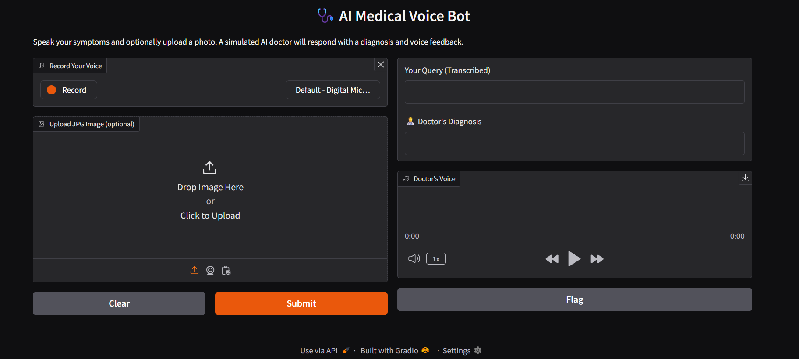

# Medical Vision and Voice Chatbot

A multi-phase AI-powered healthcare chatbot designed to simulate a natural, voice-based interaction between a **patient** and a **virtual doctor**. Built entirely in Python, the system integrates speech recognition, image analysis, natural language understanding, and text-to-speech synthesis, all wrapped in a clean Gradio interface.

The chatbot utilizes the GROQ inference engine to intelligently route requests to different APIs:

For medical understanding of user queries (spoken or image-based), it uses Meta’s LLaMA 4 Scout model to generate accurate and realistic doctor-like responses.

To generate the doctor’s voice response, it uses ElevenLabs TTS, which offers high-quality, human-like audio.

For speech-to-text, it leverages OpenAI Whisper v3 via GROQ’s accelerated inference.

The project runs locally and supports real-time patient input (voice + image) and produces both textual and spoken doctor feedback, making it ideal for demonstrating AI capabilities in digital health.

---

##  Project Overview

The chatbot is structured into **4 modular phases**, each handling a distinct part of the interaction:

| Phase       | Component                             | Script                    |
| ----------- | --------------------------------------| ------------------------- |
| **Phase 1** |  Brain of the Doctor (LLM logic )     | `brain_of_the_doctor.py`  |
| **Phase 2** |  Voice of the Patient (Speech → Text) | `voice_of_the_patient.py` |
| **Phase 3** |  Voice of the Doctor (Text → Speech)  | `voice_of_the_doctor.py`  |
| **Phase 4** |  Gradio Frontend Interface            | `front_app.py`            |

---

##  Setup Instructions

### 🛆 Prerequisites

Ensure the following are installed:

* Python 3.8+
* `ffmpeg` (for audio processing)
* `portaudio` (for microphone input)
* `git` (for cloning the repo)

> ⚠️ Download and install [FFmpeg](https://ffmpeg.org/download.html) and [PortAudio](http://www.portaudio.com/download.html) before proceeding.

---

### 🛠️ Installation Steps

```bash
# 1. Clone the repository
git clone https://github.com/your-username/medical-voice-chatbot.git
cd medical-voice-chatbot

# 2. Create a virtual environment
python -m venv venv

# 3. Activate the environment
# On Windows:
venv\Scripts\activate
# On macOS/Linux:
source venv/bin/activate

# 4. Install required dependencies
pip install -r requirements.txt

# 5. Run the command
python front_app.py
```

---

## 🧪 Running the Application

### [User (Patient)]
     |
     | (1) Voice Input via Microphone
     v

### [Voice of the Patient]
 - Python records audio
 - Whisper model via Groq (STT)
     |
     v

### [Text Input + Optional Image]
     |
     |---------------------------> Optional Image (.jpg)
     |                             |
     v                             v

### [Brain of the Doctor]
 - Uses LLaMA model via Groq API
 - Image encoded if provided
 - Doctor-like response generated
     |
     v

### [Voice of the Doctor]
 - ElevenLabs TTS API generates MP3
     |
     v

### [Gradio UI]
 - Shows transcribed text
 - Doctor's textual diagnosis
 - Plays Doctor's voice
---

##  File Structure

```bash
medical-voice-chatbot/
│
├── brain_of_the_doctor.py        # Doctor's AI brain logic (LLM or rule-based)
├── voice_of_the_patient.py       # Captures and converts patient voice to text
├── voice_of_the_doctor.py        # Converts doctor's response to speech
├── front_app.py                  # Gradio frontend app
├── requirements.txt              # Python dependencies
├── README.md                     # You are here
└── assets/                       # Optional: audio models, data files
```

---

##  Features

*  Voice interaction for both patient and doctor
*  LLM-driven medical Q\&A logic
*  Gradio-based web UI
*  Modular design for each phase

---

##  Example Use Case

* A patient speaks a symptom (via microphone)
* Speech is converted to text → processed by the doctor brain
* The doctor’s diagnosis is read aloud
* Interaction is accessible via Gradio UI

---

## Image

*

*<video controls src="demo_medical.mp4" title="Demo Video"></video>

##  Notes

* Internet connection may be required if using cloud APIs (e.g., OpenAI, Google TTS/STT).
* Ensure `ffmpeg` is in your system path.

---

##  Contact

For questions or suggestions, contact \[[sanchitkanwar31@gmail.com](mailto:sanchitkanwar31@gmail.com)] or open an issue.
